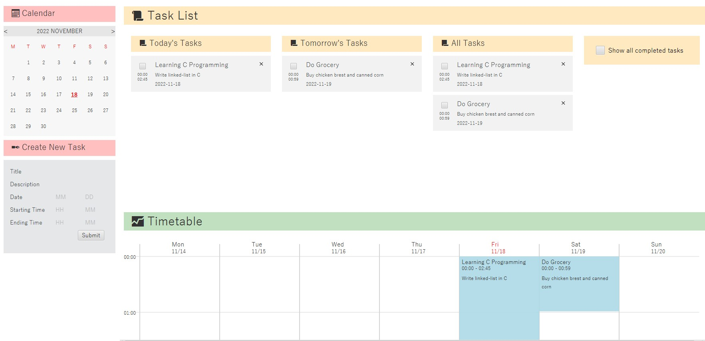

# What is this application?

This application is a mix between a to-do list and a timetable.

I have been looking for personal
task management software that includes both a to-do list and timetable features.
Yet unfortunately, I failed to find one. I tried making one on Notion, but I couldn't make a template
that is user-friendly and convenient. Not to mention running on Notion already made the 'application'
bulky. This is what triggered me to develop one on my own.

Of course, there are a lot of improvements to be made before this software is ready to be used in real life. But I would
call this a great head start.

# How to use

## Creating New Task

Create a new task by inputting the information of the new task in the "Create New Task" prompt.

## Updating Task Information

Information on the existing tasks can be updated in the "Update Task" prompt. To open it, you may:

1. Left-click the target task in the "Task List" section

2. Control + left-click the target task in the "Timetable" section

## Updating Task's Date and Time

Aside from modifying these attributes in the "Update Task" prompt, you may also modify then
visually in "Timetable"

1. Drag and move the task freely with left-click to change the date and the starting time
2. Shift + left-click the task and drag up and down to change the task's duration

